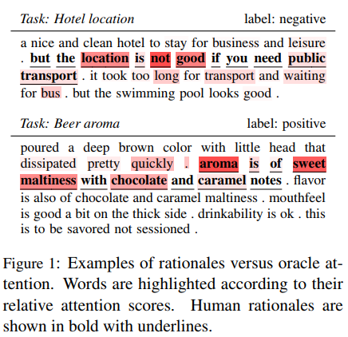
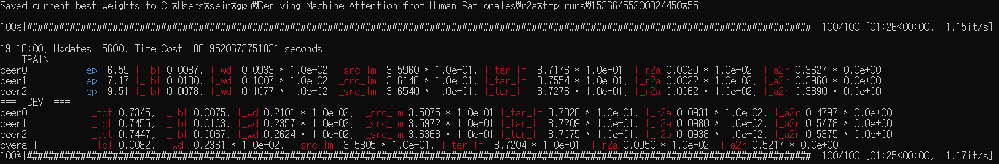

# Deriving-Machine-Attention-from-Human-Rationales

해당 repo는 아래 논문에 대한 정리입니다.

**[Deriving Machine Attention from Human Rationales](https://arxiv.org/pdf/1808.09367.pdf).** *Yujia Bao, Shiyu Chang, Mo Yu and Regina Barzilay. EMNLP 2018.* 
```
@article{bao2018deriving,
  title={Deriving Machine Attention from Human Rationales},
  author={Bao, Yujia and Chang, Shiyu and Yu, Mo and Barzilay, Regina},
  journal={arXiv preprint arXiv:1808.09367},
  year={2018}
}
```

논문의 저자 Yujia Bao가 Code와 모든 걸 본인의 [Github](https://github.com/YujiaBao/R2A)에 공개 하여, 해당 자료를 참고 하였습니다.


## 요약
논문의 목적은, human rationales를 high-quality machine attention (R2A)로 매핑하는 법을 배운 모델을 활용하여 Classification 성능을 향상시키는 것 입니다.

<p align="center">

</p>

아래 그림은 논문에서 제안하는 전체적인 Pipeline입니다.

<p align="center">

</p>


## 데이터
원본 데이터는 [beer review](https://snap.stanford.edu/data/web-BeerAdvocate.html), [hotel review](http://www.cs.virginia.edu/~hw5x/dataset.html)의 링크를 통해서 다운 받을 수 있습니다.

논문에서 실험에 사용한 데이터는 [data.zip](https://people.csail.mit.edu/yujia/files/r2a/data.zip)입니다.
**Important Note:** 해당 데이터는 오직 연구 목적(Research-purpose only)으로만 사용 가능합니다.


## 실험
### Training R2A
메모리 이슈 때문에 논문에서 사용한 pretrained word embedding인 "fasttext.en.300d" 대신에 "fasttext.simple.300d"를 사용했습니다.
<p align="center">

</p>
Training 과정...

### Testing R2A

### Training target classifier

### Testing target classifier
